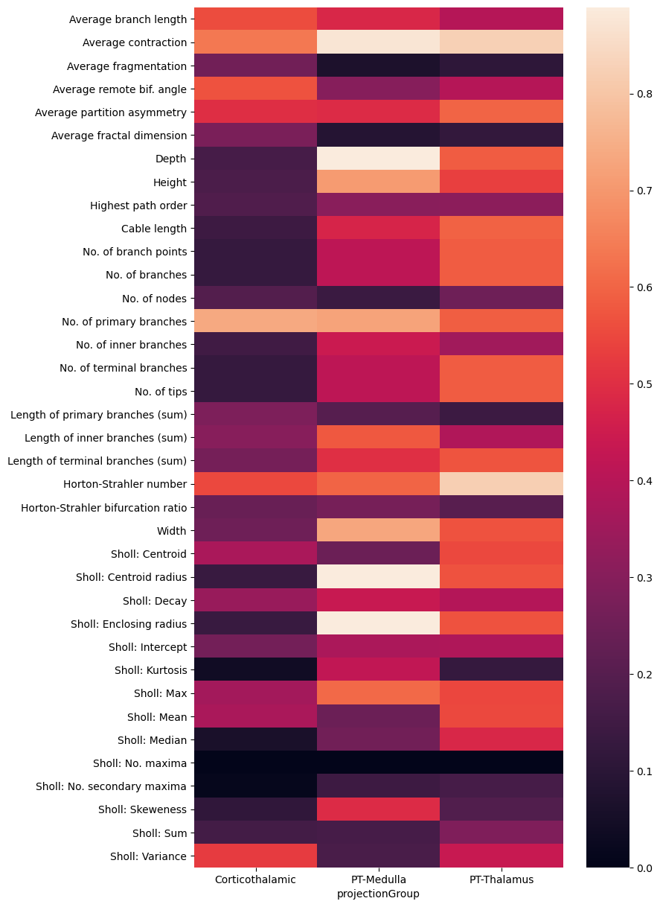

## Metrics

This directory contains scripts that describes the distributions of all of SNT metrics. It does so, by comparing the three types of MouseLight neurons from Somatomotor areas layer 5 and 6 described in Fig. 6 of [Winnubst et al. 2019](https://pubmed.ncbi.nlm.nih.gov/31495573/):

- Group 1: Layer 6 CT neurons projecting to the Thalamus
- Group 2: Layer 5 PT neurons projecting to the Medulla 
- Group 3: Layer 5 PT neurons projecting to the Thalamus

Selected cells from these groups, Layer 6 CT and Layer 5 PT are also analyzed in [Fig. S7](./FigS7_PopulationDiagrams/). The MouseLight IDs of the cells are as follows:

| Layer 6 CT                                                                                                                                                                 | Layer 5 PT-Medulla                                                                   | Layer 5 PT-Thalamus                                                                                                             |
|----------------------------------------------------------------------------------------------------------------------------------------------------------------------------|--------------------------------------------------------------------------------------|---------------------------------------------------------------------------------------------------------------------------------|
| AA0039, AA0101, AA0103, AA0105 AA0188, AA0278, AA0390, AA0394, AA0406, AA0577, AA0599, AA0633,  AA0650, AA0781, AA0784, AA0799, AA0817, AA0837, AA0838, AA0844 | AA0012, AA0131, AA0133, AA0134, AA0169, AA0179, AA0180, AA0576, AA0788, AA0923 | AA0011, AA0114, AA0115, AA0122, AA0181, AA0182, AA0245, AA0261, AA0415, AA0617, AA0764, AA0780, AA0792, AA0926 |
| N=20                                                                                                                                                                       | N=10                                                                                 | N=14                                                                                                                            |

For simplicity, the analysis was split across 3 scripts:

1. [retrieve_swcs.py](./retrieve_swcs.py) (To be run from Fiji's script editor): Downloads (and visualizes) the reconstruction files
2. [ExtractMetrics.groovy](./ExtractMetrics.groovy) (To be run from Fiji's script editor): Measures the downloaded files in SNT
3. [analysis.py](./analysis.py) (To be run from a Python environment [NB: numpy, pandas, seaborn, scipy, sklearn required]). Performs the analysis, namely:  *Features heatmap* in which each computed metrics is scaled to 0-1 range, clustering and distributions.

Layer 6 CT :

Layer 5 PT-Medulla :

Layer 5 PT-Thalamus :

Heatmap:

PCA:

Distributions:

